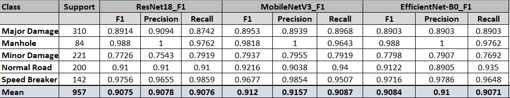
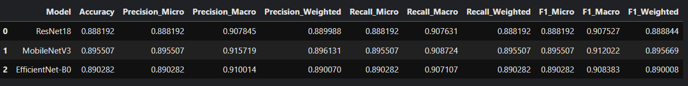
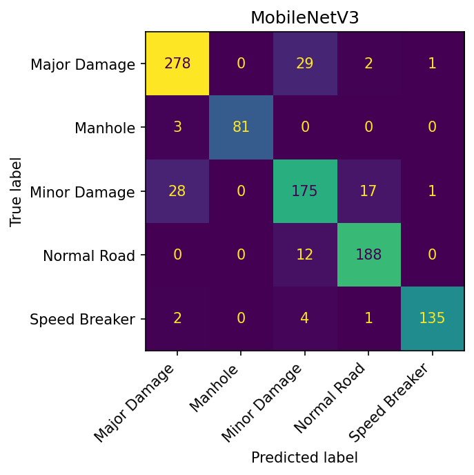
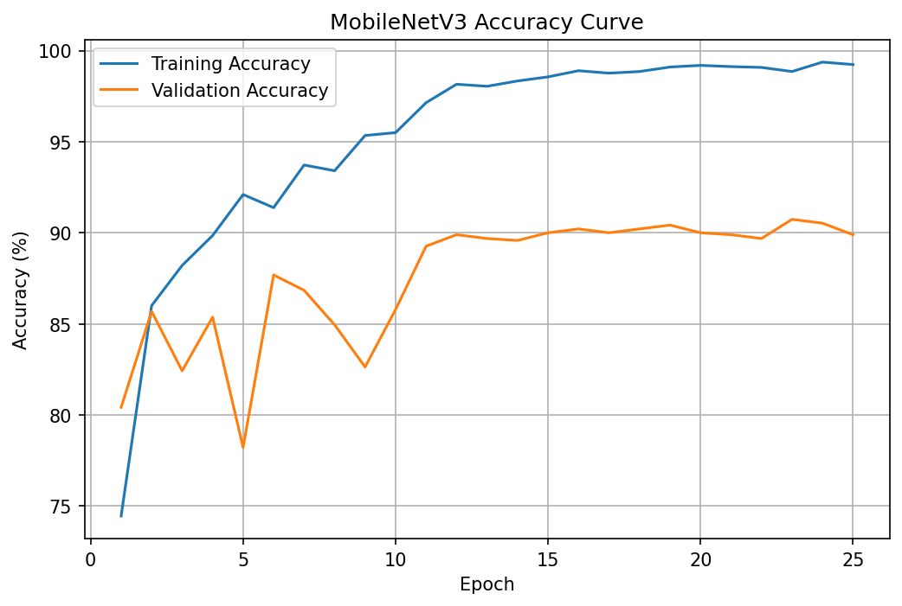
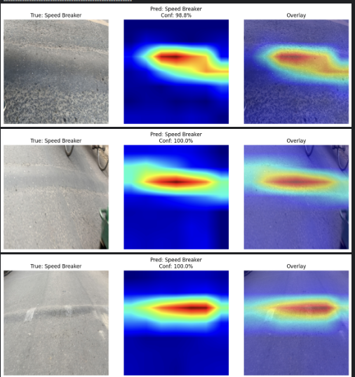

# Road Damage Multiclass Classification

A deep learning-based multiclass image classification system for identifying different types of road conditions using the **BDRoad-Sense** dataset and transfer learning with pretrained CNN architectures.

The project compares **ResNet18, MobileNetV3-Small, and EfficientNet-B0** and selects the final model based on classification performance, model size, and computational efficiency.

## Project Overview

Road condition recognition is an important component of intelligent transportation and autonomous driving systems. This project classifies road images into five categories:

* Major Damage
* Minor Damage
* Normal Road
* Manhole
* Speed Breaker

Three pretrained CNN architectures were evaluated, with **MobileNetV3-Small** achieving the best overall performance while having significantly fewer parameters and a much smaller model size.

## Dataset

The project uses the **BDRoad-Sense** dataset.

Dataset reference:

[BDRoad-Sense Research Article](https://pmc.ncbi.nlm.nih.gov/articles/PMC13247582/?utm_source=chatgpt.com#sec0009)

### Dataset Statistics

| Split      |    Images |
| ---------- | --------: |
| Training   |     4,443 |
| Validation |       950 |
| Test       |       957 |
| **Total**  | **6,350** |

### Classes

1. Major Damage
2. Minor Damage
3. Normal Road
4. Manhole
5. Speed Breaker

### Data Augmentation

The original training dataset was used rather than the pre-augmented training set provided with the dataset.

Data augmentation was applied dynamically through the project's transformation pipeline during training.

This approach avoids directly using the dataset's pre-generated augmented images while still providing variation during model training.

## Models

Three pretrained CNN architectures were evaluated:

* ResNet18
* MobileNetV3-Small
* EfficientNet-B0

All models were evaluated using the same overall classification task and evaluation dataset.

## Model Comparison

| Model                 |   Accuracy |   F1 Macro | F1 Weighted | Parameters (M) | Model Size (MB) |
| --------------------- | ---------: | ---------: | ----------: | -------------: | --------------: |
| ResNet18              |     0.8882 |     0.9075 |      0.8888 |          11.31 |           43.14 |
| **MobileNetV3-Small** | **0.8955** | **0.9120** |  **0.8957** |       **1.07** |        **4.10** |
| EfficientNet-B0       |     0.8903 |     0.9084 |      0.8900 |           4.34 |           16.54 |

### Final Model

**MobileNetV3-Small** was selected as the final model.

It achieved the highest:

* Accuracy: **89.55%**
* Macro F1: **91.20%**
* Weighted F1: **89.57%**

At the same time, it has only **1.07M parameters** and a model size of approximately **4.10 MB**, making it substantially lighter than ResNet18 and EfficientNet-B0.

This makes MobileNetV3-Small a practical choice when both classification performance and deployment efficiency are important.

## Class-wise Performance



The model performs particularly well on **Manhole** and **Speed Breaker** classes.

The **Minor Damage** class is comparatively more challenging, which is also reflected in its lower precision, recall, and F1-score.

## Training Configuration

| Parameter               | Value             |
| ----------------------- | ----------------- |
| Input Image Size        | 224 × 224         |
| Batch Size              | 32                |
| Learning Rate           | 0.001             |
| Epochs                  | 25                |
| Optimizer               | AdamW             |
| Scheduler               | ReduceLROnPlateau |
| Loss Function           | Cross Entropy     |
| Weight Decay            | 0.01              |
| Gradient Accumulation   | 2 steps           |
| Early Stopping Patience | 8                 |
| Random Seed             | 1                 |
| Hardware                | Kaggle GPU        |

## Evaluation

The trained models were evaluated using:

* Accuracy
* Precision
* Recall
* Macro F1-score
* Weighted F1-score
* Confusion Matrix
* Class-wise Classification Report

### Model Comparison



### Class-wise Performance Comparison


### MobileNetV3 Confusion Matrix



### Training Curves



## Grad-CAM

Grad-CAM was implemented to provide visual interpretability of the model's predictions.

The visualization highlights the regions of an image that contribute most strongly to the model's prediction.

Grad-CAM was applied to the final **MobileNetV3-Small** model using the last convolutional layer.



The visualization demonstrates that the model focuses on relevant road regions when making predictions. Some misclassified examples were also observed, which is expected in visually similar road-damage categories.

## Project Structure

```text
road-damage-multiclass-classification/
│
├── graphs/
│   ├── class_distribution.png
│   ├── class_distribution_train.png
│   ├── EfficientNet-B0_cm.png
│   ├── gradcam_speed_breaker.png
│   ├── MobileNetV3_cm.png
│   ├── Model_comparison.png
│   ├── ResNet18_cm.png
│   ├── training_curve_mobilnet.png
│   └── training_samples_grid.png
│
├── notebooks/
│   ├── 01-dataset-understanding-and-eda.ipynb
│   ├── 02-dataloader-visualizor.ipynb
│   ├── 03-training-models.ipynb
│   ├── 04-evaluate.ipynb
│   └── 05-gradcam.ipynb
│
├── src/
│   ├── dataset.py
│   ├── gradcam.py
│   ├── inference.py
│   ├── loss.py
│   ├── model.py
│   └── train.py
│
├── main.py
├── model_comparison.csv
├── model_class_wise_comparison.csv
├── README.md
└── .gitignore
```

## Notebooks

The project is organized into five notebooks covering the complete workflow:

### 01 — Dataset Understanding and EDA

Explores:

* Dataset structure
* Class distribution
* Dataset statistics
* Data quality
* Training data distribution

### 02 — DataLoader Visualization

Covers:

* Dataset loading
* Transformations
* Augmentation
* Sample visualization
* DataLoader verification

### 03 — Training Models

Trains and compares:

* ResNet18
* MobileNetV3-Small
* EfficientNet-B0

### 04 — Model Evaluation

Evaluates the trained models using:

* Accuracy
* Precision
* Recall
* F1-score
* Confusion matrices
* Classification reports
* Model comparison

### 05 — Grad-CAM

Provides model interpretability using Grad-CAM and visualizes the regions influencing model predictions.

## Inference

Inference is implemented in `src/inference.py`.

The inference module loads the trained model and performs prediction on an input image.

The inference workflow can be imported and called through the implemented inference class/function.

## Installation

Clone the repository:

```bash
git clone https://github.com/gracyy-rm/road-damage-multiclass-classification.git
cd road-damage-multiclass-classification
```

Install the required dependencies:

```bash
pip install -r requirements.txt
```

> Make sure the required PyTorch installation is compatible with your available CPU/GPU environment.

## Training

The main training entry point is:

```bash
python main.py
```

The training pipeline uses the dataset, transformation, model, loss, and training modules implemented under `src/`.

## Results

The final **MobileNetV3-Small** model achieved:

| Metric      |       Score |
| ----------- | ----------: |
| Accuracy    |  **89.55%** |
| Macro F1    |  **91.20%** |
| Weighted F1 |  **89.57%** |
| Parameters  |   **1.07M** |
| Model Size  | **4.10 MB** |

### Why MobileNetV3-Small?

Although all three architectures achieved comparable performance, MobileNetV3-Small provided the best overall trade-off between **classification performance and model efficiency**.

Compared with ResNet18:

* ~7.5× fewer parameters
* ~10.5× smaller model size
* Higher validation/test accuracy in the reported comparison
* Higher Macro F1

This makes it a suitable choice for applications where computational and memory efficiency matter.

## Limitations

* The Minor Damage class remains comparatively difficult to classify.
* Some road conditions have visually similar characteristics, which can lead to misclassification.
* The current evaluation focuses primarily on classification performance rather than real-time deployment benchmarks.
* The dataset size is relatively limited compared with large-scale image classification datasets.

## Future Improvements

Potential improvements include:

* Increasing the training dataset size
* Exploring stronger augmentation strategies
* Further tuning of learning rate and regularization
* Addressing class-level performance differences
* Testing additional lightweight architectures
* Evaluating inference speed on edge devices
* Adding a larger collection of Grad-CAM examples
* Investigating model quantization for deployment

## Repository

[Road Damage Multiclass Classification — GitHub](https://github.com/gracyy-rm/road-damage-multiclass-classification?utm_source=chatgpt.com)

## License

This project is intended for educational and research purposes.
